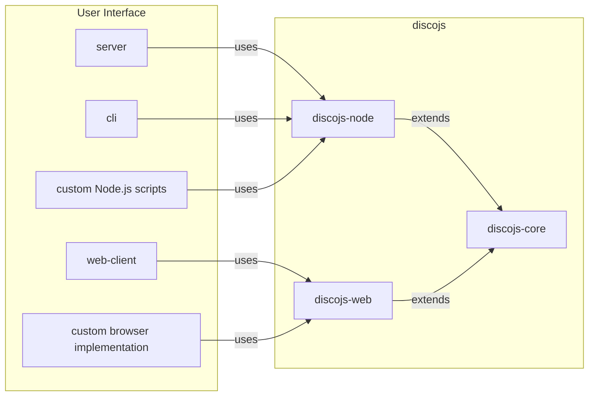

<div align="center">
  <h1>DISCO <code>developer guide</code></h1>
  <p>
    <a href="https://github.com/epfml/disco/actions/workflows/lint-test-build.yml"></a>
    <a href="https://github.com/epfml/disco/actions/workflows/deploy-server.yml"></a>
  </p>
  </br>

</div>

Welcome to the DISCO developer guide. 
Here you will have a first overview of the project, how to install and run an instance of DISCO and links to further documentation.

## Structure

The DISCO project is composed of multiple parts. At the root level, there are four main folders: `discojs`, `server`, `web-client` and `cli`.

- `discojs`, or Disco.js, is the JavaScript library that contains federated and decentralized learning logic. The library allows to train and use machine learning models in a distributed fashion. The library itself is composed of the `disco-node` and `disco-web` modules, both of them extending the platform-agnostic code in `disco-core`. In other words, `disco-core` contains most of the implementation but can't be used by itself, while `disco-web` and `disco-node` allow using `disco-core` via different technologies. To some extents, you can think of `disco-core` as an abstract class extended by `disco-web`and `disco-node`.
    - `disco-node` lets you use Disco.js with Node.js. For example, the `server` and the `cli` rely on `disco-node`. A user can also directly import the `disco-node` package in their Node.js programs.
    - `disco-web` allows using Disco.js through a browser. The `web-client`, discussed below, relies on `disco-web` to implement a browser UI.
      
  The main difference between the two is how they handle storage: a browser doesn't have access to the file system (for security reasons) while a Node.js application does.
- `server` contains the server implementation necessary to use Disco.js. Indeed, while the federated and decentralized learning logic is implemented by Disco.js, we still need a server to orchestrate users in both paradigms. In decentralized learning, the server exposes an API for users to query the necessary information to train models in a decentralized fashion, such as the list of other peers. Thus, the server never receives training data or model parameters. In federated learning, the server receives model updates but never training data. It keeps track of participants and updates the model weights. A `server` instance is **always** necessary to use DISCO, whether one is using a browser UI, the CLI or directly programming with `disco-node`.
- `web-client` implements a browser User Interface. In other words, it implements a website allowing users to use DISCO without coding. Via the browser, a user can create and participate in federated and decentralized training sessions, evaluate models, etc.
- `cli` contains the Command Line Interface for Disco.js. For example, the CLI allows a user to create and join training sessions from the command line, benchmark performance by emulating multiple clients, etc.

Here is a summary diagram:



## Installation guide

The following instructions will install the required dependencies, build Disco.js and launch a DISCO server and a web client. If you run into any sort of trouble check our [FAQ](./docs/FAQ.md); otherwise please create a new issue or feel free to ask on [our slack](https://join.slack.com/t/disco-decentralized/shared_invite/zt-fpsb7c9h-1M9hnbaSonZ7lAgJRTyNsw). 

1. We recommend using [nvm](https://github.com/nvm-sh/nvm) (Node Version Manager) to handle multiple Node.js versions. Start by installing `nvm` by following [their installation instructions](https://github.com/nvm-sh/nvm).
After installation, you should be able to run
```
nvm -v
0.39.7 # my nvm version at the time
```
2. Install Node.js version 16
```
nvm install 16
```
You can now choose which Node.js version to use:
```
nvm use 16
```
Using Node.js v16 should automatically set your [npm](https://docs.npmjs.com/about-npm) (Node Package Manager, different from n**v**m) version to 8:
```
npm --version
8.xx.xx
```
`nvm` manages your different Node.js versions while `npm` handles your different Node.js project packages within one version.

3. Clone the repository
```
git clone git@github.com:epfml/disco.git
cd disco
```

4. Run the installation script
```
sh install.sh
```

<details>
  <summary><b>What does <code>install.sh</code> do?</b></summary>
  </br>
  The installation script installs the dependencies required by the different parts of the project, which are described in the Structure section.
  It first installs the Disco.js library dependencies, notably, `TensorFlow.js`, and anything else required for federated and decentralized learning logic. 
  The script then builds the library, a step necessary to compile TypeScript into JavaScript.
  
  ```
  cd discojs
  npm ci # stands for `clean install`, to ensure than only expected dependencies are being installed.
  npm run build
  ```
  The script then installs dependencies for the web client, which implements a browser UI.
  By default, the project points to the [@epfml/disco-web](https://www.npmjs.com/package/@epfml/discojs) package published on the `npm` remote repository. In a development environment, we want to use the local web client in the `discojs/web-client` folder. To do so, we need to link the local folder as the actual dependency.
  
  ```
  cd ../web-client
  npm ci
  npm link ../discojs/discojs-web
  ```
  You can verify than the link is effective by checking that `npm ls` lists `@epfml/discojs@x.x.x -> ./../discojs/discojs-web`.

  Similarly, we install the server dependencies, and then the `discojs-node` dependency to the local folder rather than the remote npm package [@epfml/disco-node](https://www.npmjs.com/package/@epfml/discojs-node):
  ```
  cd ../server
  npm ci
  npm link ../discojs/discojs-node
  ```
  Install the CLI dependencies:
  ```
  cd ../cli
  npm ci
  ```
  Finally, we install `ts-node` globally in order to compile and run TypeScript code in a single command from anywhere.
  ```
  npm install -g ts-node
  ```
  
</details>

5. Launch DISCO
   
As you may have seen, there are many ways to use DISCO. Here we will run a server and a web client. From there, a user can use DISCO from their browser.
* First launch a `server` instance, which is used for federated and decentralized learning tasks, e.g. to list peers participating in a decentralized task.
```
cd server
npm run dev
```
The server should be listening on `http://localhost:8080/`.
* Secondly, start a web client, which will allow you to use DISCO from your browser. You may have to do so **from another terminal** since the previous one is now used by the server.
```
cd web-client
npm run dev
```
The web client should be running on `http://localhost:8081`, if not first restart the server and then the web client.

> [!IMPORTANT]
> Make sure to first start the server to ensure that it is listening to port 8080.

**You can now access DISCO at http://localhost:8081/**


## Further documentation

* Next you may want to read our [onboarding guide](./docs/ONBOARDING.md) which lists the following steps to onbaord DISCO.  Additionally the [Architecture guide](./docs/ARCHITECTURE.md) gives more information on our use of TypeScript and Vue.js, the frontend framework.
* If you are only planning to use DISCO in your own scripts, you can find a stand-alone example relying on `discojs-node` [here](./docs/node_example). The example runs with Node.js outside any browser, using the `@epfml/discojs-node` NPM package and the `server` module. A DISCO server is launched by the script itself and the data is already available in the repo.

#### Table of contents
As there are many guides in the project, here is a table of contents referencing them all:
* [DISCO README](./README.md)
* [Developer guide](./DEV.md)
* The `docs` folder contains in-depth documention on the project:
	* [Onboarding guide](./docs/ONBOARDING.md)
	* [Contributing guide](./docs/CONTRIBUTING.md)
	* [Disco.js under the hood](./docs/DISCOJS.md)
	* [Architecture and frameworks guide](./docs/ARCHITECTURE.md)
	* [FAQ](./docs/FAQ.md)
	* [Example: using `discojs-node` in a script](./docs/node_example/README.md)
	* [Privacy in DISCO](./docs/PRIVACY.md)
	* [How to create a DISCO Task](./docs/TASK.md)
	* [Vue.js architecture](./docs/VUEJS.md)
* Respective `README` files contain installation and packaging instructions relevant to the module
	* [`discojs` README](./discojs/README.md)
		* [`discojs-core` README](./discojs/discojs-core/README.md)
		* [`discojs-node` README](./discojs/discojs-node/README.md)
		* [`discojs-web` README](./discojs/discojs-web/README.md)
	* [`server` README](./server/README.md)
	* [`web-client` README](./web-client/README.md)
	* [`cli` README](./cli/README.md)
