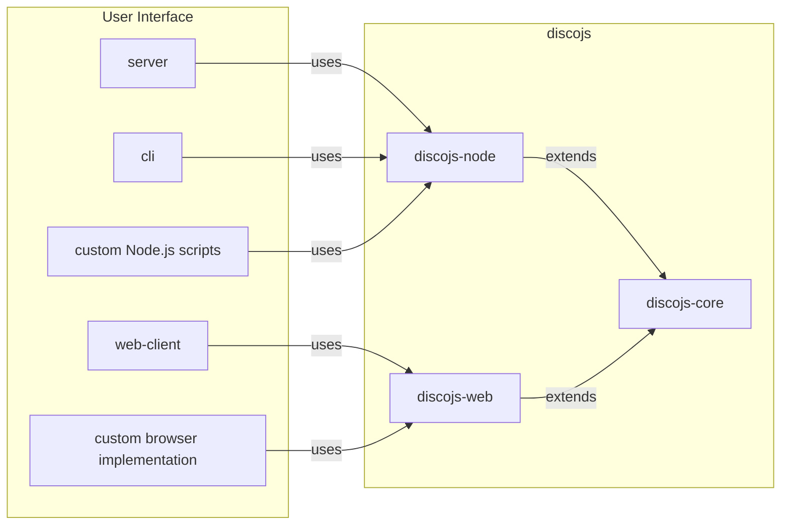

<div align="center">
  <h1>DISCO <code>developer guide</code></h1>
  <p>
    <a href="https://github.com/epfml/disco/actions/workflows/lint-test-build.yml"></a>
    <a href="https://github.com/epfml/disco/actions/workflows/deploy-server.yml"></a>
  </p>
  </br>

</div>

Welcome to the DISCO developer guide.
Here you will have a first overview of the project, how to install and run an instance of DISCO and links to further documentation.

## Structure

The DISCO project is composed of multiple parts. At the root level, there are four main folders: `discojs`, `server`, `web-client` and `cli`.

- `discojs`, or Disco.js, is the TypeScript library that contains federated and decentralized learning logic. The library allows to train and use machine learning models in a distributed fashion. The library itself is composed of the `disco-node` and `disco-web` modules, both of them extending the platform-agnostic code in `disco-core`. In other words, `disco-core` contains most of the implementation but can't be used by itself, while `disco-web` and `disco-node` allow using `disco-core` via different architectures. To some extents, you can think of `disco-core` as an abstract class extended by `disco-web`and `disco-node`.
  - `disco-node` lets you use Disco.js with Node.js. For example, the `server` and the `cli` rely on `disco-node`. A user can also directly import the `disco-node` package in their Node.js programs.
  - `disco-web` allows using Disco.js through a browser. The `web-client`, discussed below, relies on `disco-web` to implement a browser UI.
    The main difference between the two is how they handle storage: a browser doesn't have access to the file system (for security reasons) while a Node.js application does.
- `server` contains the server implementation necessary to use Disco.js. Indeed, while the federated and decentralized learning logic is implemented by Disco.js, we still need a server to orchestrate users in both paradigms. In decentralized learning, the server exposes an API for users to query the necessary information to train models in a decentralized fashion, such as the list of other peers. Thus, the server never receives training data or model parameters. In federated learning, the server receives model updates but never training data. It keeps track of participants and updates the model weights. A `server` instance is **always** necessary to use DISCO, whether one is using a browser UI, the CLI or directly programming with `disco-node`.
- `web-client` implements a browser User Interface. In other words, it implements a website allowing users to use DISCO without coding. Via the browser, a user can create and participate in federated and decentralized training sessions, evaluate models, etc.
- `cli` contains the Command Line Interface for Disco.js. For example, the CLI allows a user to create and join training sessions from the command line, benchmark performance by emulating multiple clients, etc.

Here is a summary diagram:



## Installation guide

The following instructions will install the required dependencies, build Disco.js and launch a DISCO server and a web client. If you run into any sort of trouble check our [FAQ](./docs/FAQ.md); otherwise please create a new issue or feel free to ask on [our slack](https://join.slack.com/t/disco-decentralized/shared_invite/zt-fpsb7c9h-1M9hnbaSonZ7lAgJRTyNsw).

**1.** Clone the repository

```
git clone git@github.com:epfml/disco.git
cd disco
```

**2.** Install Node.js

We recommend using [nvm](https://github.com/nvm-sh/nvm) (Node Version Manager) to handle multiple Node.js versions. Start by installing `nvm` by following [their installation instructions](https://github.com/nvm-sh/nvm).
After installation, you should be able to run

```
nvm -v
0.39.7 # at the time of writing
```

Use it to install the version we use in DISCO.

```
nvm install # it reads `.nvmrc` to select the correct version
```

`nvm` manages your different Node.js versions while `npm` handles your different Node.js project packages within one version.

**3.** Install the dependencies

```
npm ci
```

**4.** Build the projects

Then we need to builds the packages meaning compile TypeScript into JavaScript.

Disco is split in multiple packages, called workspaces in NPM, which are described in the [Structure Section](#structure).
You can add `--workspaces` (or shorter as `-ws`) to many `npm` commands to act on all packages.
Or you can select a specific workspace via `--workspace=$name-or-path-to-package` (`-w $name-or-path-to-package`).

```
npm -ws run build
```

**5.** Download and extract the sample training datasets. These datasets are used in the automated tests.

```
./datasets/populate
```

**6.** Launch DISCO

As you may have seen, there are many ways to use DISCO. Here we will run a server and a web client. From there, a user can use DISCO from their browser.

- First launch a `server` instance, which is used for federated and decentralized learning tasks, e.g. to list peers participating in a decentralized task.

```
npm -w server start
```

The server should be listening on `http://localhost:8080/`.

- Secondly, start a web client, which will allow you to use DISCO from your browser. You will have to do so **from another terminal** since the previous one is now used by the server.

```
npm -w web-client start # from another terminal
```

The web client should be running on `http://localhost:8081`, if not first restart the server and then the web client.

**You can now access DISCO at http://localhost:8081/**

## How to use DISCO

There are multiple ways to use and interact with DISCO, depending on your objective:

- A non-technical user that wants to train models in a distributed manner without coding would want to use DISCO through the `web-client`. To do so, starting a local `server` instance is also needed as a backend to the `web-client`. Similarly, a contributor aiming to implement new UI features would certainly want to run the same setup.
- A technical user may find it more flexible to use DISCO from a Node.js script, which gives users a finer control over the process. The `discojs-node` module is tailored to be used in Node.js scripts and allows to load data, helps starting a server and run distributed machine learning training tasks.
- Finally, the `cli` (command line interface) can also be used to quickly start distributed model trainings. The `CLI` is more restricting than using `discojs-node` but allows to start training with multiple users in a single command. It is useful for benchmarking for example.

**Training on your own datasets:** DISCO provides pre-defined training tasks, such as CIFAR10, Titanic, etc. The [Tasks document guide](./docs/TASK.md) describes how to add custom tasks from the web-client UI, a `discojs-node` script or how to add support for a new pre-defined task.

### `web-client` and `server`

The last step of the installation instructions describe how to start a web interface along with a helper server. The server is used to provide some predefined machine learning tasks and orchestrate distributed training.

From the root level, launch a `server` instance:

```
npm -w server start
```

The server should be listening on `http://localhost:8080/`.

Start the web-client:

```
npm -w web-client start # from another terminal
```

The web client should be running on `http://localhost:8081`. Running the last command should also output a Network address at which devices on the same network can access the UI. You can find more information in the [Contributing to the `web-client`](./docs/CONTRIBUTING.md#contributing-to-web-client) Section as well as the [server README](./server/README.md).

### Importing `discojs-node` with Node.js

Using `discojs-node` is illustrated in [the `examples` folder](./docs/examples). Using `discojs-node` implies starting a server (or having access to one), loading local training data and configuring the model training.

### `cli`

Training a model with the `cli` on pre-defined tasks is straightforward:

```
# From the root folder
npm -w cli start -- --task cifar10 --numberOfUsers 4 --epochs 15 --roundDuration 5
npm -w cli start -- --help # for all options
```

Adding CLI support for another task is described in the [CLI README](./cli/README.md).

## Further documentation

- To contribute or modify the codebase have a look at the [contributing guide](./docs/CONTRIBUTING.md) which lists the following steps to onboard DISCO.
- If you are only planning to use DISCO in your own scripts, you can find a standalone example relying on `discojs-node` in [the `examples` folder](./docs/examples). The example runs with Node.js outside any browser, with `discojs-node` and a `server` instance. A DISCO server is launched by the script which then loads data and emulates multiple users training a model in a federated manner.

#### Table of contents

As there are many guides in the project, here is a table of contents referencing them all:

- [DISCO README](./README.md)
- [Developer guide](./DEV.md)
- The `docs` folder contains in-depth documentation on the project:
  - [Contributing guide](./docs/CONTRIBUTING.md)
  - [TASK.md: training on your own dataset](./docs/TASK.md)
  - [Disco.js under the hood](./docs/DISCOJS.md)
  - [`examples` folder: using `discojs-node`, adding a custom task](./docs/examples)
  - [Privacy in DISCO](./docs/PRIVACY.md)
  - [Vue.js in DISCO](./docs/VUEJS.md)
  - [FAQ](./docs/FAQ.md)
- `README` files contain information relevant to their respective module:
  - [`server` README](./server/README.md), with API and deployment information
  - [`cli` README](./cli/README.md)
