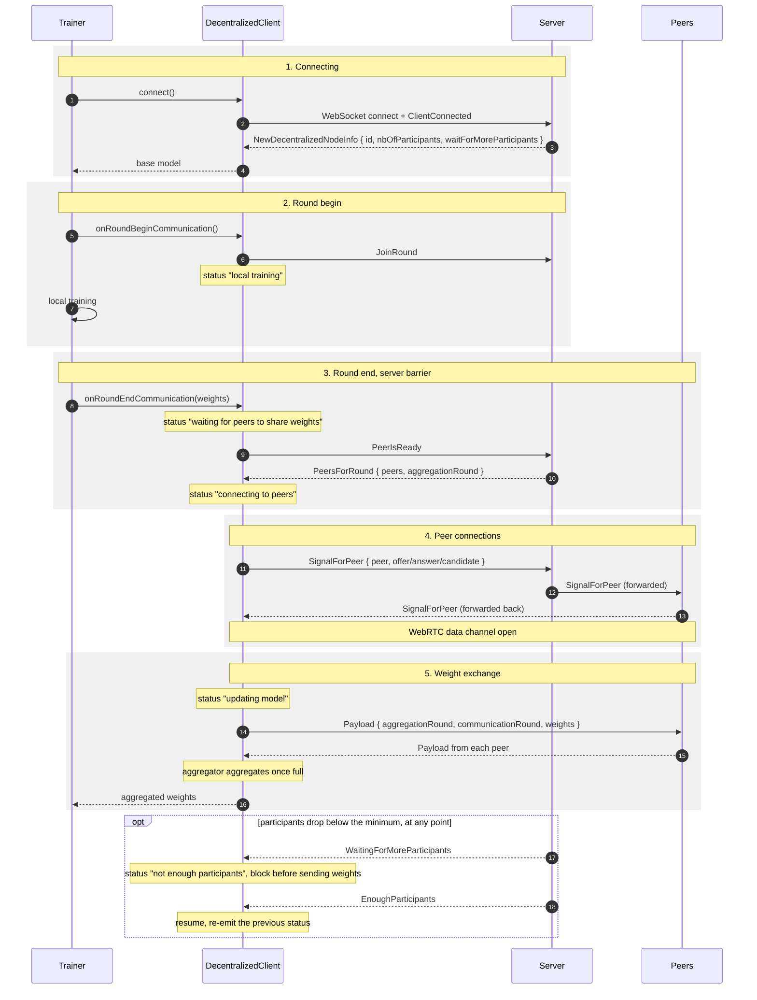

# Decentralized Event flow

```mermaid
sequenceDiagram
    autonumber
    participant T as Trainer
    participant C as DecentralizedClient
    participant S as Server
    participant P as Peers

    rect rgb(240,240,240)
        Note over T,S: 1. Connecting
        T->>C: connect()
        C->>S: WebSocket connect + ClientConnected
        S-->>C: NewDecentralizedNodeInfo { id, nbOfParticipants, waitForMoreParticipants }
        C-->>T: base model
    end

    rect rgb(240,240,240)
        Note over T,S: 2. Round begin
        T->>C: onRoundBeginCommunication()
        C->>S: JoinRound
        Note over C: status "local training"
        T->>T: local training
    end

    rect rgb(240,240,240)
        Note over T,P: 3. Round end, server barrier
        T->>C: onRoundEndCommunication(weights)
        Note over C: status "waiting for peers to share weights"
        C->>S: PeerIsReady
        S-->>C: PeersForRound { peers, aggregationRound }
        Note over C: status "connecting to peers"
    end

    rect rgb(240,240,240)
        Note over C,P: 4. Peer connections
        C->>S: SignalForPeer { peer, offer/answer/candidate }
        S->>P: SignalForPeer (forwarded)
        P-->>C: SignalForPeer (forwarded back)
        Note over C,P: WebRTC data channel open
    end

    rect rgb(240,240,240)
        Note over C,P: 5. Weight exchange
        Note over C: status "updating model"
        C->>P: Payload { aggregationRound, communicationRound, weights }
        P-->>C: Payload from each peer
        Note over C: aggregator aggregates once full
        C-->>T: aggregated weights
    end

    opt participants drop below the minimum, at any point
        S-->>C: WaitingForMoreParticipants
        Note over C: status "not enough participants", block before sending weights
        S-->>C: EnoughParticipants
        Note over C: resume, re-emit the previous status
    end
```
