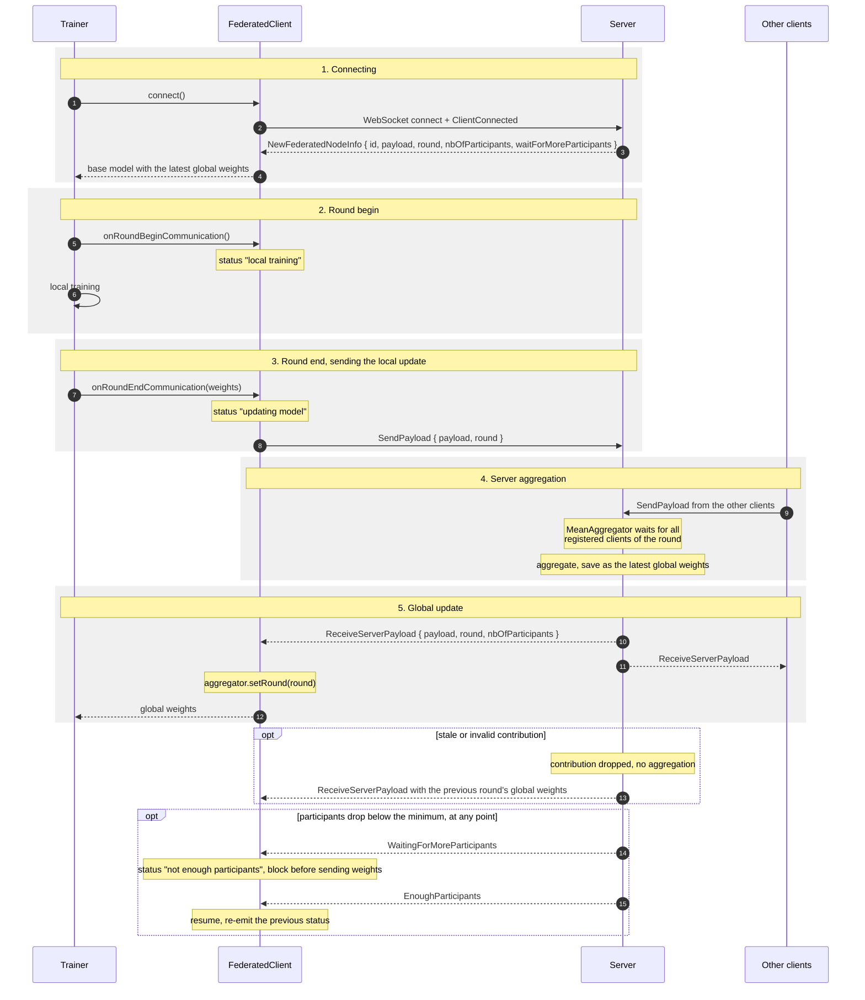

# Federated Event flow

```mermaid
sequenceDiagram
    autonumber
    participant T as Trainer
    participant C as FederatedClient
    participant S as Server
    participant O as Other clients

    rect rgb(240,240,240)
        Note over T,S: 1. Connecting
        T->>C: connect()
        C->>S: WebSocket connect + ClientConnected
        S-->>C: NewFederatedNodeInfo { id, payload, round, nbOfParticipants, waitForMoreParticipants }
        C-->>T: base model with the latest global weights
    end

    rect rgb(240,240,240)
        Note over T,S: 2. Round begin
        T->>C: onRoundBeginCommunication()
        Note over C: status "local training"
        T->>T: local training
    end

    rect rgb(240,240,240)
        Note over T,S: 3. Round end, sending the local update
        T->>C: onRoundEndCommunication(weights)
        Note over C: status "updating model"
        C->>S: SendPayload { payload, round }
    end

    rect rgb(240,240,240)
        Note over C,O: 4. Server aggregation
        O->>S: SendPayload from the other clients
        Note over S: MeanAggregator waits for all<br/>registered clients of the round
        Note over S: aggregate, save as the latest global weights
    end

    rect rgb(240,240,240)
        Note over T,O: 5. Global update
        S-->>C: ReceiveServerPayload { payload, round, nbOfParticipants }
        S-->>O: ReceiveServerPayload
        Note over C: aggregator.setRound(round)
        C-->>T: global weights
    end

    opt stale or invalid contribution
        Note over S: contribution dropped, no aggregation
        S-->>C: ReceiveServerPayload with the previous round's global weights
    end

    opt participants drop below the minimum, at any point
        S-->>C: WaitingForMoreParticipants
        Note over C: status "not enough participants", block before sending weights
        S-->>C: EnoughParticipants
        Note over C: resume, re-emit the previous status
    end
```
