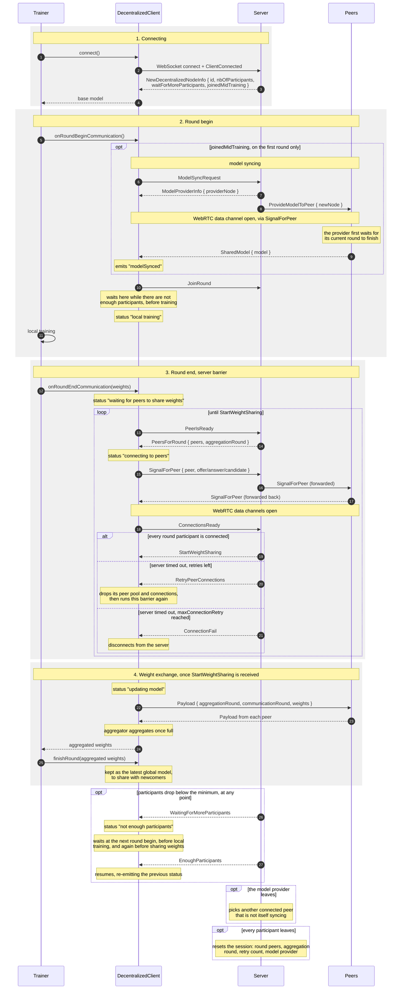

# Peer Connection in Decentralized Learning

This document describes how peer connections for decentralized learning are established.
Relevant code can be found in [decentralized controller](../server/src/controllers/decentralized_controller.ts) and [decentralized client](../discojs/src/client/decentralized/decentralized_client.ts).

Peer connections for decentralized learning are coordinated by the server. However, model weight updates are shared only between peers.

## Peer Connection and Round Participation

Clients first connect to the server. The server then coordinates which clients should participate in each decentralized training round.

At the beginning of each round, clients send `JoinRound` messages to the server. After that, they send `PeerIsReady` messages to notify the server that they are ready to establish peer connections and exchange model updates.

For each round, the server assumes that all currently connected clients are participating, except for clients that are still syncing their model after joining in the middle of training. Once the server has received `PeerIsReady` messages from all expected participants for the round, it sends a `PeersForRound` message to each participant. This message tells clients which peers they should connect to for the current round.

After receiving `PeersForRound`, participants establish peer connections and proceed with decentralized learning.

### Connection Ready Check and Signaling Weight Sharing

Before clients start sharing model weights, the server checks that all participants have successfully completed peer connection setup. This prevents faster clients from starting weight sharing while slower clients are still establishing connections.
The process is as follows:

1. After completing peer connections, each client sends a `ConnectionsReady` message to the server.
2. The server counts the number of received `ConnectionsReady` messages.
3. Once the number of `ConnectionsReady` messages matches the number of expected participants for the round, the server sends a `StartWeightSharing` message to all round participants.
4. Clients only start sharing model updates after receiving `StartWeightSharing`.

### Connection Retries and Failed Client Disconnection

Peer connections may fail, so decentralized training includes a retry mechanism. The maximum number of retries is controlled by `maxConnectionRetry`, which is specified in the task training information.

The retry mechanism is triggered when the server times out while waiting for `ConnectionsReady` messages.
The process is as follows:

1. If the number of retries is still below `maxConnectionRetry`, the server sends a `RetryPeerConnections` message to all peers in the current round.
2. When clients receive `RetryPeerConnections`, they clean up their peer pool and aggregator nodes, then rerun the peer connection phase.
3. If the connection setup still fails after more than `maxConnectionRetry` attempts, the server removes the failed peers from the round peer list.
4. The server sends a `ConnectionFail` message to the failed peers.
5. When a client receives `ConnectionFail`, it disconnects from the server.
6. The remaining clients receive `RetryPeerConnections` and retry the peer connection phase without the failed peers.

This allows the remaining participants to continue training even when one or more peers fail to establish connections.

### Model Syncing for Participants Joining in the Middle of Training

Participants that join in the middle of training need to receive the latest model before they can participate in future rounds. In decentralized learning, peers do not send model weights to the server, so the newcomer must request the latest model from an existing peer.

The model syncing process is as follows:

1. When a new participant joins in the middle of training, the server marks the participant as having joined mid-training in `NewDecentralizedNodeInfo`.
2. After receiving `NewDecentralizedNodeInfo`, the new client sets a local flag indicating that it needs model syncing.
3. When training begins, if this flag is set, the new client sends a `ModelSyncRequest` message to the server.
4. After receiving `ModelSyncRequest`, the server sends messages as step 5 and 6, using selected model provider information from previous training round.
5. The server sends `ModelProviderInfo` to the new participant with information about the provider peer.
6. The server sends `ProvideModelToPeer` to the provider peer with information about the newly joined peer.
7. Using this signaling information, the new participant and provider peer establish a peer connection.
8. The provider waits until the current aggregation round has finished, then sends the latest global model to the new participant using a `SharedModel` message. The model shared is the result of the decentralized aggregation, so all participating peers hold the same model at that point.
9. The new participant receives the model and updates its local model weights.
10. After syncing, the new participant can join subsequent decentralized training rounds.

## Event flow

