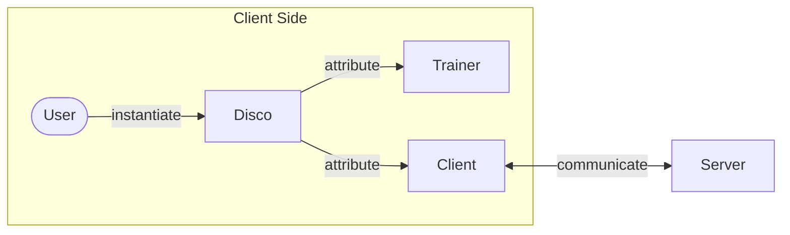
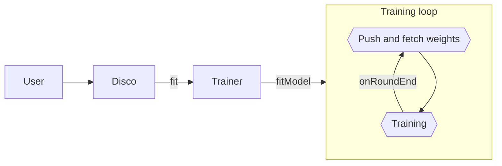
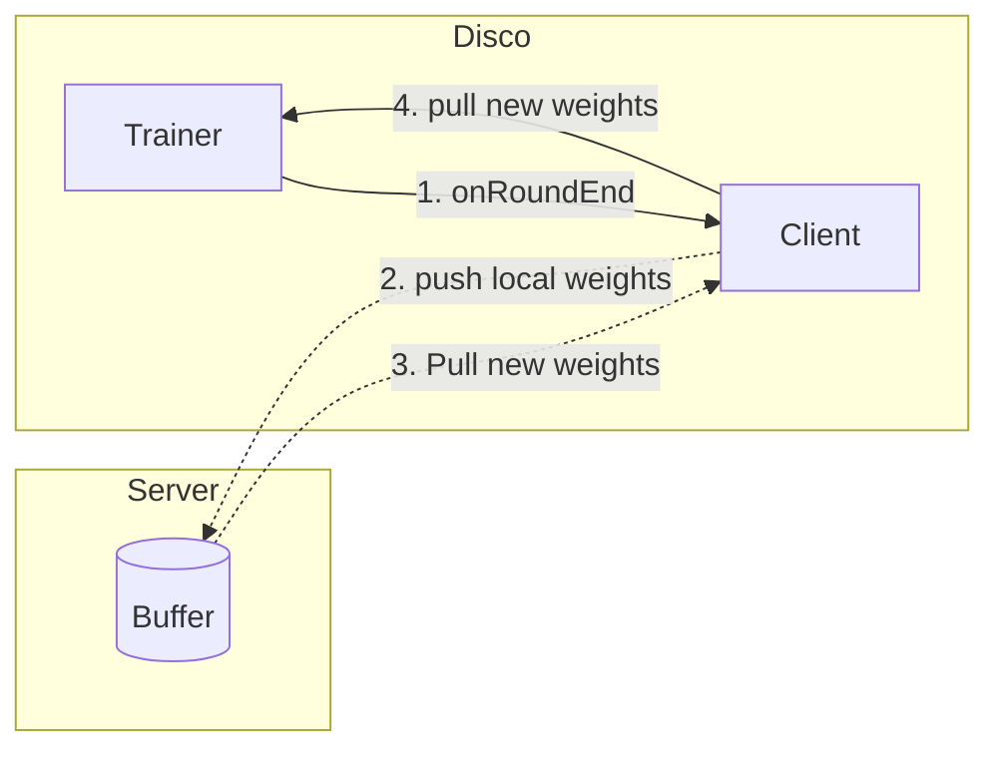
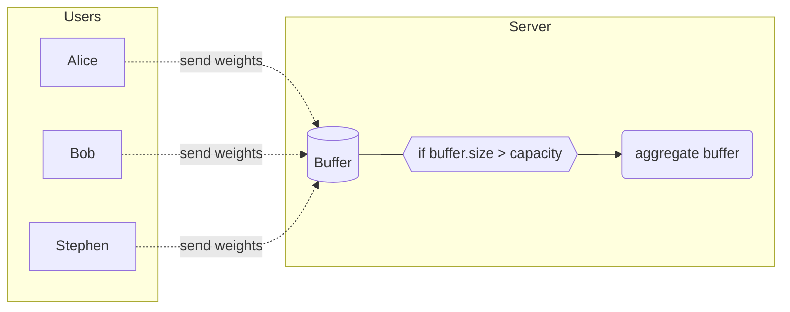

# `Disco.js` under the hood

This guide goes over how the core logic is structured and what are the main abstractions of Disco.js, implemented in `discojs/discojs-core`.
As described in the [developer guide](../DEV.md), `discojs-node` and `discojs-web` are simple wrappers allowing to use `discojs-core` code from different platforms and technology, namely, a browser or Node.js. 

### Terminology

Many terms are used in DISCO and unfortunately they are not always used in the same ways. Here is an attempt to clarifying and present the main terms and concepts as well as how they relate to each other:
* A `node` is any relevant machine on the network participating in the distributed learning. Nodes refer to both server and client. Note that `node` in `discojs-node` refers to Node.js. Except for the package name, node (in contrast to Node.js) always refers to a network node.
* A `client` or a `user` is a node with local data performing local model updates. In other words, a client  refers to any node participating in distributed learning that isn't the server. Note that in Disco.js, a client is represented by multiple abstractions, such as the `Client` and the `Trainer`. Therefore, the `Client` class only implements parts of what everything a `client` does in distributed learning and mostly handles communications with the server or other clients. More specifically, the `Client` class handles communication (creating payloads, websockets, etc.) with peers and the server, while the concept of a distributed learning `client` has to load their local data, train the model, send updates etc.
* `peer` is synonym to `client` or `user` in decentralized learning, in which case the communication is organized in a peer-to-peer network.
* The `server` is the node listening to incoming requests from other nodes. There is a single server in a distributed task (but a server may handle multiple tasks concurrently).
* A `task` refers to the training of one model, whether distributed or not (DISCO also lets one train a model locally). Accordingly, multiple tasks may happen in parallel.

### Federated learning

> [!Tip]
> Some knowledge about distributed learning is necessary to understand Disco.js' implementation. For instance, you can have a look at [this paper](https://arxiv.org/abs/1912.04977), written by the Google researchers that coined the term "Federated Learning", reviewing the advances and open areas of distributed learning at the time of 2019.

For simplicity, we will talk mostly of federated learning. In the relevant cases, we specify how the decentralized scheme differ. The typical scenario of federated learning involves multiple clients and one server. Each client pulls model weights from the server and train the model on their local data. After a few iterations, potentially asynchronously, clients push their new respective weights to the server, which aggregates the weights into a new model after receiving enough updates. The clients then pull the new model weights and start training locally again. In decentralized learning, clients mostly interact with each other but still have communicate with the server, for example to get the list of peers participating in the session. 

See here a schema of the main objects in Disco.js:


The user-facing object of Disco.js is the `Disco` class, which is composed of different classes enabling distributed learning. These classes are the `Trainer` and the `Client`, the former handles training and the latter deals with communication. Since different training and communication schemes are available, these classes are abstract and various inheriting classes exist for the different schemes (e.g., `FederatedClient` for federated communication with a central server).
Once you understand how these classes work you will have a good grasp of DISCO. The remaining classes mostly deal with building these objects and making them work together.

> [!Note]
> In order to focus on the essentials, most of the following code snippets will be incomplete with respect to the actual code

## Trainer

The `Trainer` class is instantiated by client nodes and contains all the code relevant for local training. Its main method is `fitModel`, which trains a model on a given dataset and is a simple wrapper around [TensorFlow.js' method](https://js.tensorflow.org/api/latest/#tf.LayersModel.fitDataset). The `Trainer` class is abstract, and requires a certain number of functions, so-called "callbacks", related to distributed learning to be implemented.

```js
abstract class Trainer {
    ...
    async fitModel (
        dataset: tf.data.Dataset<tf.TensorContainer>,
        valDataset: tf.data.Dataset<tf.TensorContainer>
      ): Promise<void> {
    
        await this.fitModelFunction(this.model,
          this.task.trainingInformation,
          dataset,
          valDataset,
          (e, l) => this.onEpochBegin(e, l),                 // All the callbacks
          (e, l) => this.onEpochEnd(e, l),
          async (e, l) => await this.onBatchBegin(e, l),
          async (e, l) => await this.onBatchEnd(e, l),
      }
    
    protected async onBatchEnd (_: number, logs?: tf.Logs): Promise<void> {
        this.roundTracker.updateBatch()                      // Update the batch count
    
        if (this.roundTracker.roundHasEnded()) {
          await this.onRoundEnd(logs.acc)        // The round ends after a certain number of batches
        }
    }
    
    // An example of an abstract callback signature
    protected abstract onRoundEnd (accuracy: number): Promise<void>
    ...
}
```
Since `onBatchEnd` is called every time a batch ends during training, it is the perfect place to perform weight sharing, pushing local weights and pulling the new aggregated weights. In order to only share weights every x number of batches (what we call "rounds", explained below), we use a `roundTracker`. 

The `DistributedTrainer` and `LocalTrainer` classes inheriting from `Trainer` implement the actual callbacks and what happens when a round ends. The `LocalTrainer` is class dedicated to training a model on a single node, i.e., centralized training. As such, the `LocalTrainer` simply updates its local model weights at the end of each round. In comparison, `DistributedTrainer` sends an update containing its local weights, and then pulls the new weights resulting from the aggregation of other updates.

### Rounds

A round is measured in batches, so if we say, "share weights every round" and the `roundDuration` is 5, it means that weights are shared every
5 batches. The user keeps track of **two** types of rounds: one is local to the trainer, the `roundTracker`,
and is simply used by the client training loop to know when to call `onRoundEnd`. 

The other round can be found in the `FederatedClient`, called the `serverRound`, and is incremented by the server after every model update, when weights are aggregated. 
When a client retrieves a model from the server, it also keeps track of the server round (this happens in the `FederatedClient`). You can think of the `serverRound` as a 
versioning number for the server model to make sure clients use the latest model weights.

Here's an example to better understand how `serverRound` is used. Say we have user A, and a server S. Let us write inside parentheses the current
rounds, e.g., A(i) and S(k) denote that the `serverRound` of user A is `i` and the server round of the server is `k`. 

When A pulls a model from S(k), the client will update its own round A(k). Then A starts to train, it pushes to the server every 
time a local round ends (the `roundTracker` helps keeping track of when a round ends); note this doesn't influence A(k). 

Once a round ends, A pushes its weights A(k) to the server. There are two cases to consider:
1. Server is still at round `k`, the server model has not been updated in the meantime. Thus, the server stores the weights of A(k) in the server buffer for a later update.
2. Server is now at round `l`, s.t. `l > k`, meaning that the server has already aggregated weights into a new model while A was training. In this case, the server rejects A's weights,
A fetches the new model, and updates its round to A(l) and continue training with the new model.

## Client

The `Client` class mostly handles sending and receiving weights from the current client to the server (or other peers in decentralized learning). `Client` is an abstract class that requires the methods such as `onRoundEndCommunication` to be implemented. Currently, the two classes implementing `Client` are the `FederatedClient` and the `DecentralizedClient`. For simplicity, we explain here how the 
`FederatedClient` works.

After some local training iterations, the client first pushes its weights to the server and waits to receive new aggregated weights, if any.
If there are no new weights the client continues performing updates with the current model. When the `roundTracker` counts the end of a round, the `Trainer` calls the `Client` `onRoundEndCommunication` to perform weight sharing.

```js
async onRoundEndCommunication (
    weights: WeightsContainer,
    round: number,
    trainingInformant: informant.FederatedInformant
  ): Promise<void> {

    
    await this.sendPayload(this.aggregator.makePayloads(weights).first()) // Send the local weights to the server
    
    await this.receiveResult()      // Fetch the server result or timeout after some time
                                    // The result is stored in this.serverResult

    if (this.serverResult !== undefined) { // Save the weights if the result is not undefined
        this.aggregator.add(Base.SERVER_NODE_ID, this.serverResult, round, 0) // add the new weights to the aggregator
    }
  }
```
In the federated case, pushing the new weights to the "aggregator" will let the `Trainer` use these weights in the next round without aggregating anything. 

### Aggregators

The aggregator object is used by every nodes, clients and server. In the federated case, the server leverages an aggregator instance to aggregate the local weight updates it received into new model weights. In decentralized learning, the `Client` stores its peer's local weight updates into the aggregator which in turn aggregates the weights when it received enough updates. While the `FederatedClient` relies on an aggregator, it only receives weight updates from the server and the aggregator simply transmits the new weights to the `Trainer`. In fact, the federated client's aggregator works the same as in the decentralized scheme, but aggregates the updates whenever it receives an update. After aggregation, the `Trainer` pulls the aggregator's latest weights into the model.

There are currently two aggregation strategies. The federated aggregation strategy is to simply average the weight updates, implemented by the `MeanAggregator`. `SecureAggregator` is used in decentralized learning, and implements secure-multi party computation.

## Disco

The `Disco` object is composed of the `Trainer` and `Client` classes along with some other helper classes. Once it's built you can
start the magic by calling `disco.fit(data)`!

In the federated case, the `Disco` objet will instantiate a `DistributedTrainer` and a `FederatedClient`. Users start training with `disco.fit()`, 
for example via a browser UI, the CLI or a Node.js script. In turns, `Disco` calls its `Trainer`'s `fitModel()` method. The `Trainer` and the 
`Client` interact between each rounds, to push local weights and pull aggregated weights from the server.



Here is the sequence of events between each round:


Once the weights have been pushed, the `Client` proceeds to fetch the latest weights if any.

## Server

Federated learning in DISCO works asynchronously. The server has a buffer which stores client weight updates as they come. Once the buffer size exceeds its `capacity`, the server aggregates all the weights and increments the round by 1.



## Appendix

### Memory

The `DistributedTrainer` has a `memory` attribute that is used to abstract how trained models are stored by the client. As mentioned in various guides, `discojs-core` is platform-agnostic and  only what endpoints the memory storage should offer. The actual implementation is in `discojs-web` used by the browser UI and implements the memory via IndexedDB, a browser storage. `discojs-core` also implements a dummy memory, used by the CLI for example, to benchmark performance metrics without saving any models.

### Training informant

The `TrainingInformant` attribute of the `Trainer` is used to observe and track the state of the trainer (e.g. accuracy, current round, ...), which is used in the browser to display
training information.

### Developing

Both the server and browser use hot-reloading, this means that they are both *watching* the files for changes,
and so whenever you change a server .ts file, then the server will reload (ditto for the browser).

However at the time of writing there is no such mechanism (this could be a fun first contribution!) for discojs.
If you noticed in the quick start before building the library we do `rm -rf dist`, we remove the `dist/` directory
which is where discojs is transpiled to (this contains JS code); so if we re-build discojs this acts as cache which
may sadly on some edge cases prevent new code from being built, so to be sure, it is recommended to remove this
cache before building.

### Debugging 

The easiest way to see what is going on is by using `console.log`, often times we want to see what value is inside 
a variable to make sure what is going on, e.g. `console.log('uniName:', uniName)`, however there is a nice shortcut
that is good to know: `console.log({uniName})`, by adding curly brackets we put uniName in an object which when printed
will give the name and contents (e.g. epfl) of the variable: `{uniName: epfl}`. 

