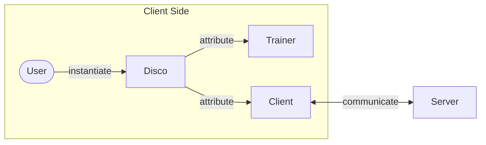
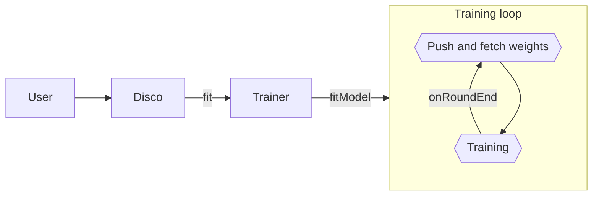
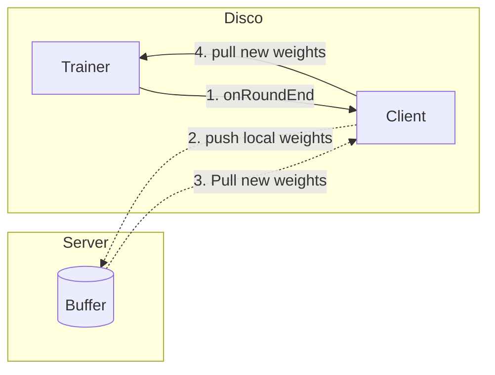
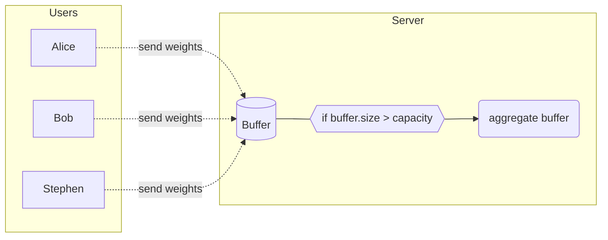

# `Disco.js` under the hood

This guide goes over how the core logic is structured and what are the main abstractions of Disco.js, implemented in `discojs`.
As described in the [developer guide](../DEV.md), `discojs-node` and `discojs-web` are simple wrappers allowing to use `discojs` code from different platforms and technology, namely, a browser or Node.js.

### Terminology

Many terms are used in DISCO and unfortunately they are not always used in the same ways. Here is an attempt to clarifying and present the main terms and concepts as well as how they relate to each other:

- A `node` is any relevant machine on the network participating in the distributed learning. Nodes refer to both server and client. Note that `node` in `discojs-node` refers to Node.js. Except for the package name, node (in contrast to Node.js) always refers to a network node.
- A `client` or a `user` is a node with local data performing local model updates. In other words, a client refers to any node participating in distributed learning that isn't the server. Note that in Disco.js, a client is represented by multiple abstractions, such as the `Client` and the `Trainer`. Therefore, the `Client` class only implements parts of what everything a `client` does in distributed learning and mostly handles communications with the server or other clients. More specifically, the `Client` class handles communication (creating payloads, websockets, etc.) with peers and the server, while the concept of a distributed learning `client` has to load their local data, train the model, send updates etc.
- `peer` is synonym to `client` or `user` in decentralized learning, in which case the communication is organized in a peer-to-peer network.
- The `server` is the node listening to incoming requests from other nodes. There is a single server in a distributed task (but a server may handle multiple tasks concurrently).
- A `task` refers to the training of one model, whether distributed or not (DISCO also lets one train a model locally). Accordingly, multiple tasks may happen in parallel.

### Federated learning

> [!Tip]
> Some knowledge about distributed learning is necessary to understand Disco.js' implementation. For instance, you can have a look at [this paper](https://arxiv.org/abs/1912.04977), written by the Google researchers that coined the term "Federated Learning", reviewing the advances and open areas of distributed learning at the time of 2019.

For simplicity, we will talk mostly of federated learning. In the relevant cases, we specify how the decentralized scheme differ. The typical scenario of federated learning involves multiple clients and one server. Each client pulls model weights from the server and train the model on their local data. After a few iterations, potentially asynchronously, clients push their new respective weights to the server, which aggregates the weights into a new model after receiving enough updates. The clients then pull the new model weights and start training locally again. In decentralized learning, clients mostly interact with each other but still have communicate with the server, for example to get the list of peers participating in the session.

See here a schema of the main objects in Disco.js:


```mermaid
flowchart LR
    subgraph client_side [Client Side]
        node([User])-->|instantiate|Disco
        Disco-->|attribute|Trainer
        Disco-->|attribute|Client
    end
    Client<-->|communicate|Server

```

The user-facing object of Disco.js is the `Disco` class, which is composed of different classes enabling distributed learning. These classes are the `Trainer` and the `Client`, the former handles training and the latter deals with communication. Since different training and communication schemes are available, these classes are abstract and various inheriting classes exist for the different schemes (e.g., `FederatedClient` for federated communication with a central server).
Once you understand how these classes work you will have a good grasp of DISCO. The remaining classes mostly deal with building these objects and making them work together.

> [!Note]
> In order to focus on the essentials, most of the following code snippets will be incomplete with respect to the actual code

## Trainer

The `Trainer` class is instantiated by client nodes and contains all the code relevant for local training. Its main method is `fit`, which trains a model on a given dataset and is a wrapper around [TensorFlow.js' method](https://js.tensorflow.org/api/latest/#tf.LayersModel.fitDataset). The `Trainer` class is abstract, and requires two callbacks (`onRoundBegin` & `onRoundEnd`) related to distributed learning to be implemented.

A round is measured in epochs, so if we say, "share weights every round" and the `roundDuration` is 5, it means that weights are shared every 5 epochs.

`onRoundBegin` is the perfect place to perform weight sharing, pushing local weights and pulling the new aggregated weights.

The `DistributedTrainer` and `LocalTrainer` classes inheriting from `Trainer` implement the actual callbacks and what happens when a round ends. The `LocalTrainer` is class dedicated to training a model on a single node, i.e., centralized training. As such, the `LocalTrainer` simply updates its local model weights at the end of each round. In comparison, `DistributedTrainer` sends an update containing its local weights, and then pulls the new weights resulting from the aggregation of other updates.

## Client

The `Client` class mostly handles sending and receiving weights from the current client to the server (or other peers in decentralized learning). `Client` is an abstract class that requires the methods such as `onRoundEndCommunication` to be implemented. Currently, the two classes implementing `Client` are the `FederatedClient` and the `DecentralizedClient`. For simplicity, we explain here how the
`FederatedClient` works.

In the federated case, pushing the new weights to the "aggregator" will let the `Trainer` use these weights in the next round without aggregating anything.

### Aggregators

The aggregator object is used by every nodes, clients and server. In the federated case, the server leverages an aggregator instance to aggregate the local weight updates it received into new model weights. In decentralized learning, the `Client` stores its peer's local weight updates into the aggregator which in turn aggregates the weights when it received enough updates. While the `FederatedClient` relies on an aggregator, it only receives weight updates from the server and the aggregator simply transmits the new weights to the `Trainer`. In fact, the federated client's aggregator works the same as in the decentralized scheme, but aggregates the updates whenever it receives an update. After aggregation, the `Trainer` pulls the aggregator's latest weights into the model.

There are currently two aggregation strategies. The federated aggregation strategy is to simply average the weight updates, implemented by the `MeanAggregator`. `SecureAggregator` is used in decentralized learning, and implements secure-multi party computation.

## Disco

The `Disco` object is composed of the `Trainer` and `Client` classes along with some other helper classes. Once it's built you can
start the magic by calling `disco.fit(data)`!

In the federated case, the `Disco` objet will instantiate a `DistributedTrainer` and a `FederatedClient`. Users start training with `disco.fit()`,
for example via a browser UI, the CLI or a Node.js script. In turns, `Disco` calls its `Trainer`'s `fitModel()` method. The `Trainer` and the
`Client` interact between each rounds, to push local weights and pull aggregated weights from the server.


```mermaid
flowchart LR
    User-->Disco-->|fit|Trainer-->|fitModel|state
    subgraph state [Training loop]
    direction BT
    id1{{Training}}-->|onRoundEnd|id2{{Push and fetch weights}}
    id2-->id1
    end
```

Here is the sequence of events between each round:


```mermaid
flowchart RL
    subgraph Disco
        Client-->|4. pull new weights|Trainer
        Trainer-->|1. onRoundEnd|Client
    end
    subgraph Server
        S[(Buffer)]
    end
    Client-.->|2. push local weights|S
    S-.->|3. Pull new weights|Client
```

Once the weights have been pushed, the `Client` proceeds to fetch the latest weights if any.

## Server

Federated learning in DISCO works asynchronously. The server has a buffer which stores client weight updates as they come. Once the buffer size exceeds its `capacity`, the server aggregates all the weights and increments the round by 1.


```mermaid
flowchart LR
    Alice-.->|send weights|S
    Bob-.->|send weights|S
    Stephen-.->|send weights|S
    subgraph Users
        Alice
        Bob
        Stephen
    end
    subgraph Server
        S[(Buffer)]---I{{if buffer.size > capacity}}-->L(aggregate buffer)
    end
```

## Appendix

### Memory

The `DistributedTrainer` has a `memory` attribute that is used to abstract how trained models are stored by the client. As mentioned in various guides, `discojs` is platform-agnostic and only what endpoints the memory storage should offer. The actual implementation is in `discojs-web` used by the browser UI and implements the memory via IndexedDB, a browser storage. `discojs` also implements a dummy memory, used by the CLI for example, to benchmark performance metrics without saving any models.

### TensorFlow.js memory management

Tensors are **not** garbage collected by JavaScript. When a tensor object becomes unreachable, the JavaScript wrapper is collected but the memory it points to is not: it stays allocated until the tensor is explicitly disposed. Since every TF.js operation returns a _new_ tensor, forgetting to dispose tensors quickly leaks memory, especially in code that runs at every batch, epoch or round.

You can monitor the number of allocated tensors and bytes with `tf.memory()`:

```ts
console.log(tf.memory().numTensors, tf.memory().numBytes);
```

See the [TensorFlow.js documentation](https://www.tensorflow.org/js/guide/tensors_operations#memory) for the API.

#### Leaking intermediate tensors

A common leak comes from chaining operations:

```ts
// Leaks! `weights.square()` allocates a tensor that is never disposed
function squaredNorm(weights: tf.Tensor): tf.Tensor {
  return weights.square().sum();
}
```

Here, `weights.square()` creates an intermediate tensor which is only used as input to `.sum()`. Another common leak is re-assigning a variable in a loop, which loses the reference to the previous tensor:

```ts
let acc = tf.zeros([10]);
for (const t of tensors) acc = acc.add(t); // leaks the previous value of `acc` at every iteration
```

#### `tensor.dispose()` and `tf.dispose`

The most explicit way to free memory is to call `dispose()` on every tensor once it isn't needed anymore. `tf.dispose` accepts a single tensor, an array or an object of tensors (`tf.dispose([a, b, c])`) and ignores non-tensor values.

```ts
let acc = tf.zeros([10]);
for (const t of tensors) {
  const next = acc.add(t);
  acc.dispose();
  acc = next;
}
```

Use `try`/`finally` to make sure tensors are disposed even if an error is thrown in between.

#### `tf.tidy`

`tf.tidy(fn)` runs `fn` and disposes every tensor allocated during its execution, **except** the tensors returned by `fn`. This is usually the simplest way to avoid leaking intermediate tensors:

```ts
function squaredNorm(weights: tf.Tensor): tf.Tensor {
  // the tensor returned by `square()` is disposed, the one returned by `sum()` is kept
  return tf.tidy(() => weights.square().sum());
}
```

How would you fix the previous example with `acc` using `tf.tidy`?

#### Asynchronous computations

`fn` must be **synchronous**: `tf.tidy` throws if `fn` returns a `Promise`. Therefore, never `await` inside `tf.tidy`.

The usual pattern is to wrap the synchronous tensor operations in `tf.tidy`, then `await` outside of it and dispose the resulting tensor manually, for example when reading tensor values with the async `tensor.data()` (prefer it over `dataSync()` which blocks the main thread, freezing the UI in the browser):

```ts
async function frobeniusNorm(weights: tf.Tensor): Promise<number> {
  // synchronous part: intermediate tensors are disposed by tf.tidy
  const squaredTensor = tf.tidy(() => weights.square().sum());
  try {
    // asynchronous part: the tensor has to be disposed manually
    const [squared] = await squaredTensor.data();
    return Math.sqrt(squared);
  } finally {
    squaredTensor.dispose();
  }
}
```

#### Ownership conventions

To know who is responsible for disposing a tensor, we follow these conventions:

1. A function does not dispose its inputs, the caller remains responsible for them.
2. A function returning tensors (or a `WeightsContainer`) transfers their ownership to the caller, who has to dispose them.
3. Returned tensors must not alias the inputs (e.g., return `input.clone()` rather than `input`), otherwise disposing one would dispose the other.
