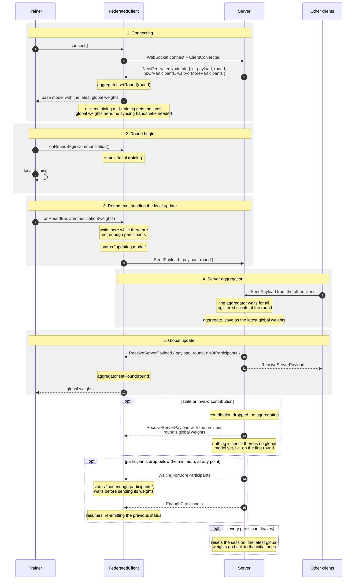

# Connections and Aggregations in Federated Learning

This documentation describes how connections between the server and clients are established, how model updates are aggregated and how updated weights are distributed.

## Connecting to the Server

Clients participating in federated learning connect directly to the server. The server acts as the central coordination and aggregation point. Therefore, the clients only need to establish a connection with the server.

When a client connects, the server assigns it a client ID and sends it the latest available global model weights and training information. The client initializes its local model with these weights and can begin training on its local model.

## Aggregating Model Updates

After finishing local training for a round, each client sends its model update to the server using a `SendPayload` message. This message contains the client's current round number so that the server can synchronize model weights aggregation.

The server checks the weight update contribution and adds it to the aggregator. When the required number of contributions has been received, the aggregator combines the client updates according to the aggregation mode and produces a new global model update.

The server then sends the aggregated result to each participants using a `ReceiveServerPayload` message. Each client updates its local model to the received weights and proceeds to the next training round.

After every successful aggregation, the server also stores the resulting weights as the latest global model weights.

## Clients Joining During Training

When a new client joins an ongoing training round, the server sends it the latest available global model weights. The new client can then begin local training from the latest globally aggregated model.

## Event flow

