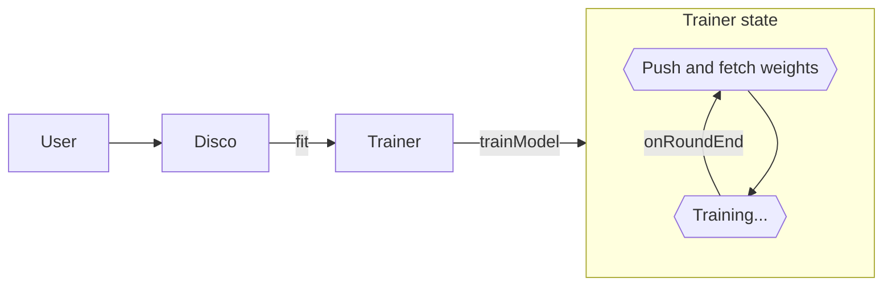
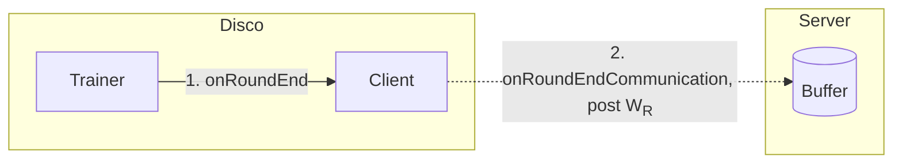
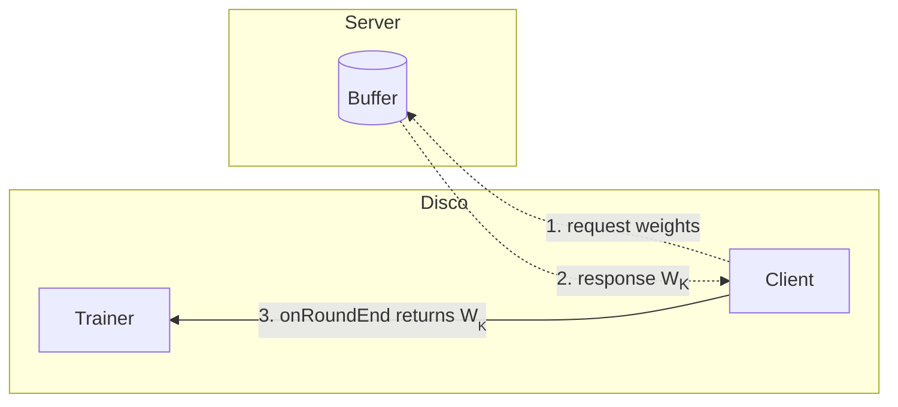
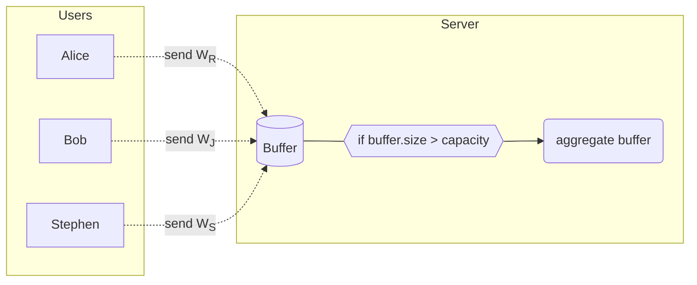

# Onboarding

Disco has grown a lot since its early days, and like with any sizeable code base, getting started is both
difficult and intimidating: There are a *lot* of files, it's not clear what's important at first, and even where to start 
is a bit of a puzzle.

The two main technologies behind Disco are TypeScript and distributed machine learning, I will assume that the reader is familiar 
with both to some extent, if not the following references might be useful. 

- [JavaScript](https://eloquentjavascript.net)
- [TypeScript](https://www.typescriptlang.org/docs/handbook/intro.html)
- [Federated and Decentralized Learning](https://arxiv.org/pdf/1912.04977)

> [!NOTE]
> Even if you are already familiar with TypeScript, federated and decentralized learning it's always good to go over the relevant material for a refresher and maybe learn what you might have missed the first time; the devil is in the details, and it is the details that maketh the expert.

If you find that certain parts of this present guide are indeed outdated, then it is *your* responsibility now to update this document in order to keep the fire
going. Good luck, and may node be with you.

> [!IMPORTANT]
> Disco is a big project so some things have been omitted, you are encouraged to add missing information!

## First steps

DISCO this is a complex project composed of the Disco.js library (`discojs`), a front-end (`web-client`),
a `server` and a `cli` (e.g., for benchmarking). Depending on what your goal is, you might only use a subset of them, e.g. you won't need an in-depth understanding of the web-client and Vue.js to add a new decentralized learning feature. Instead, you will probably rely on the CLI.

1. If you are going to work, contribute and improve the project, I first recommend you get a good understand of what DISCO does: play around with the [website](https://epfml.github.io/disco/#/), train a model from the pre-defined tasks, or even create your own custom task. Feedback is always appreciated, feel free to let us know on slack/in the github issues/in person if you noticed any issues or thought of an improvement.

2. Then, get a high-level understanding of the different parts of the projects in the [developer guide](../DEV.md), even if you're planning on working on a subset of the project. If you to know more about a specific part of the project, refer to the table of contents at the end of the guide.
   
3. Following the installation instructions from the [developer guide](../DEV.md) to launch a DISCO instance working in your browser.

> [!TIP]
> The most common issues with running DISCO are usually due to using old Node.js versions and setting the appropriate environment on M1 Macs, see [our FAQ](./FAQ.md) for more troubleshooting. Note that DISCO has been not tested on Windows (only Linux and macOS).

As mentioned in the [developer guide](../DEV.md), there are many ways to use Disco.js: from a browser, a CLI, by importing `discojs-node` in your own Node.js scripts and applications, from your own UI implementation, etc. Note that whatever your setting, using Disco.js always requires running a `server` instance. As described in the [`server` README file](../server/REDME.md), the server is in charge of connecting peers to the ML tasks. In order to connect and partake in a distributed training session you first need to find the session and how to join it, the sever exposes an API to that end.

Below you will find instructions and documentation on how to run DISCO in different settings. 

### Using DISCO from the `web-client`

Instructions on how to use the `web-client` can be found in the [developer guide](../DEV.md#installation-guide). More information, for example on how to run the client in developer mode, can be found in the [`web-client` README](../web-client/README.md).

### Using DISCO from the `cli`

The CLI is currently not working. Until then, you can find more information in the [`cli` README](../cli/README.md).

### Using DISCO from a script - Standalone example

A standalone example of disco can be found [in this folder](./node_example), with code and documentation.

## Under the hood

In this section we will go over how the core logic is structured.

[Code overview structure shown in ARCHITECTURE.md](./ARCHITECTURE.md)

The server, web client and CLI each contain all the relevant code and README.md about their respective roles which are
self-explanatory in their name.

The main core logic of disco is in `discojs/discojs-core`. In turn, the main object of Disco.js is the Disco class, which groups together the different classes that enable distributed learning; these classes are the `Trainer` and the `Client`, the latter deals with communication and the former with training. Since different types of communication and training is available these classes are abstract and various implementations exist for the different frameworks (e.g. `FederatedClient` for federated communication with a central server).

Once you understand how these two classes work (as well as it's concrete implementations) you will have a good initial grasp of Disco. The rest of the classes mostly  deal with building these objects (the [Task](./TASK.md) object specifies all this information), making them work together and so on.

> In what follows, most code snippets will be incomplete with respect to the actual code in order to focus on the essentials.

### Trainer

The trainer class contains all code relevant for training, its main method is `trainModel` which does as it would 
suggest, train a model with a given dataset. This class is abstract, and requires the method `onRoundEnd`
to be implemented which is the where the distributed learning flow starts.

```js
async trainModel (dataset: tf.data.Dataset<tf.TensorContainer>): Promise<void> {

    // Assign callbacks and start training
    await this.model.fitDataset(dataset, {
      callbacks: {
        onBatchEnd: async (epoch, logs) => await this.onBatchEnd(epoch, logs) // <-- call our own onBatchEnd
      }
    })
}

protected async onBatchEnd (_: number, logs?: tf.Logs): Promise<void> {
      this.roundTracker.updateBatch()                                         // <-- update round

    if (this.roundTracker.roundHasEnded()) {
      await this.onRoundEnd(logs.acc)                                         // <-- call onRoundEnd
    }
  }

protected abstract onRoundEnd (accuracy: number): Promise<void>
```

Note that `onBatchEnd` will be called by the TFJS's model callback, since this method is called every time a batch ends during
training it is the perfect place for weight sharing. In order to only share weights every x number of batches (i.e. every round),
we use a `roundTracker` to keep track of the of when a new round ends.

> See the appendix for more on rounds.

The distributed trainer class extends the trainer `onRoundEnd` as follows

```js
async onRoundEnd (accuracy: number): Promise<void> {

    // Post current weights and get back latest weights
    const aggregatedWeights = await this.client.onRoundEndCommunication(
      currentRoundWeights,
      this.roundTracker.round
    )

    // Update latest weights
    this.model.setWeights(aggregatedWeights)
  }
```

> How would you implement the local trainer? You can find the code for the `LocalTrainer.ts` to see if you are correct!

In `onRoundEnd` we the `client` which is the class that takes care of communication.

### Client

The client is structured similarly to the trainer, here too we have an abstract class that requires the method `onRoundEndCommunication`
to be implemented; the two implementations for it are the FederatedClient and the DecentralizedClient, we will explain how the 
FederatedClient works as it is easier to follow.

In the Federated client we first push our weights to the server, we then query for new aggregated weights, and return them if they exist;
if there are no new weights we simply return the current model.

> In the actual implementation we need to keep track of both the current and previous weight as we provide Differential Privacy.

```js
async onRoundEndCommunication (
    weights: Weights,
  ): Promise<Weights> {
    await this.postWeightsToServer(weights)                     // <--- 1. Post weights to server

    const serverWeights = await this.pullRoundAndFetchWeights() // <--- 2. Fetch new server (aggregated) weights, is undefined if none exist
    return serverWeights ?? weights                             
}
```

### Disco

The Disco object is an amalgam of the classes that we just saw along with some other less important helper classes. Once it's built you can
start the magic by calling `disco.fit(data)`!

So what happens when we start training? Let us suppose we want to do federated training, this means that the `DistributedTrainer` and `FederatedClient`
will be in action. To start training the User (this could be the browser or cli for example) calls `disco.fit`, then in turn this will
call `disco.trainer.trainModel` and this will start the trainer state which will send weights to the client at each `onRoundEnd`.



To recap our overview of the client, once onRoundEnd happens then we have the following sequence of calls with the client pushing weights to the server.




Once the weights have been pushed, the client then proceeds to fetch the latest weights; it will only fetch new weights if these correspond to a new
round, something that the client also queries.



But when are new weights available to be fetched? To understand this we will finish this section with a brief detour of the server.

#### Server

Federated learning, at the time of writing works asynchronously; the server has a buffer, which is a map from `userID` to `weights`. The buffer has a certain
*capacity*, once the size of buffer exceeds this *capacity*, then the server aggregates all the weights in the buffer and increments the round by 1.

> When a user pushes a new weight this is only included in the map if the corresponding round is new enough, and if he had already pushed a weight before, than the weight is updated.



## Appendix

### Rounds

A round is measured in batches, so if we say, "share weights every round" and the roundDuration is 5, this means that every
5 batches weights are shared. The user keeps track of **two** types of rounds, one is local to the trainer, this is the `roundTracker`
and is simply used to know when to call `onRoundEnd`; the other round can be found in the `FederatedClient`, this round corresponds 
to the **server round** of the model last fetched from the server.

The server keeps track of it's own round, and it is incremented every time weights are aggregated. When a client gets a model from
the server, it also keeps track of the server round (this happens in the `FederatedClient`. So in some sense, this round value is a 
versioning number for the server model.

To make this a bit more clear let us follow and example, say we have user A, and a Server. Let us denote inside the parenthesis the current
round of the entity, e.g. A(i), Server(k), means the current round of user A is i and server is k. 

When A pulls a model from Server(k), then the client will update its own round A(k). After this, A starts to train, it pushes to the server every 
time a local round ends (the `roundTracker` helps keeping track of when a round ends); note that this does not influence A(k). 
Once a round ends A pushes his weights to the server.

There are two cases to consider

1. Server(k), the server model still has not been updated, this means we accept the weights of A(k) to the server buffer.

2. Server(j), s.t. j > k, this means that the server has aggregated a new model while A was training, in this case we reject A's model, then
A will fetch the new model, and update his round to A(j) and continue training with the new model.

### Memory

If you look at the `DistributedTrainer` you will see a `memory` object, the goal of this class is to abstract the mechanism to store
the trained model in the client. In the browser we use IndexedDB, and in the benchmark we simply have an empty function since we are only
interested in performance metrics.

### Training informant

The `TrainingInformant` is observing the state of the trainer (e.g. accuracy, current round, ...), this is used in the browser to display
training information.

### Developing

Both the server and browser use hot-reloading, this means that they are both *watching* the files for changes,
and so whenever you change a server .ts file, then the server will reload (ditto for the browser).

However at the time of writing there is no such mechanism (this could be a fun first contribution!) for discojs.
If you noticed in the quick start before building the library we do `rm -rf dist`, we remove the `dist/` directory
which is where discojs is transpiled to (this contains JS code); so if we re-build discojs this acts as cache which
may sadly on some edge cases prevent new code from being built, so to be sure, it is recommended to remove this
cache before building.

### Debugging 

The easiest way to see what is going on is by using `console.log`, often times we want to see what value is inside 
a variable to make sure what is going on, e.g. `console.log('uniName:', uniName)`, however there is a nice shortcut
that is good to know: `console.log({uniName})`, by adding curly brackets we put uniName in an object which when printed
will give the name and contents (e.g. epfl) of the variable: `{uniName: epfl}`. 

