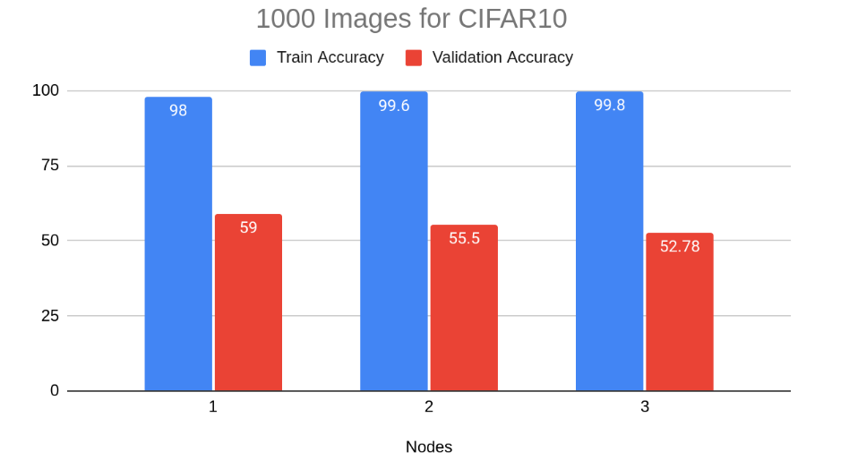
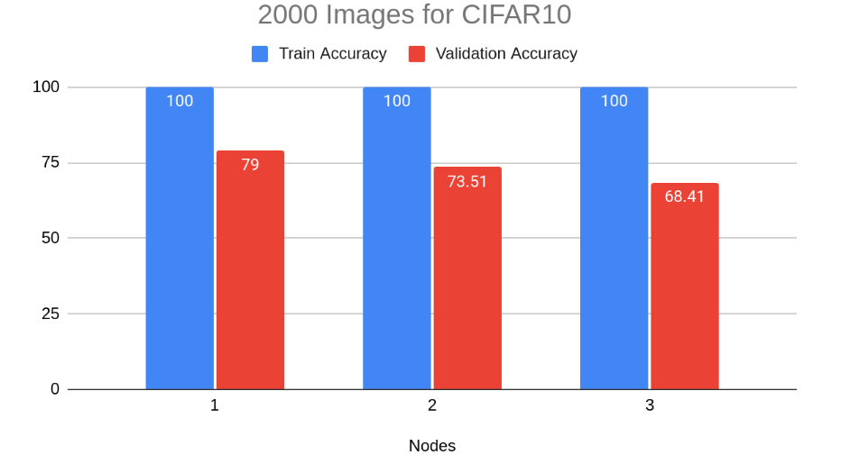
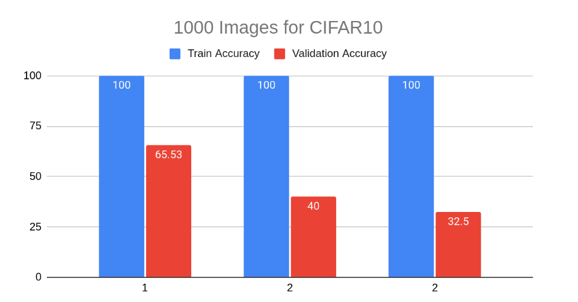

# README

# Overview

This folder is dedicated to artificial simulation of the distributed training process using the DeAI (decentralized learning) or FeAI (federated learning) platform, with many simulated users present. Our script uses the selenium library for python as it is the most popular and easy to use.

As a high level overview each of these simulation scripts firstly opens a selected number of chrome drivers, in each of these tabs the script goes to the task training page after picking the training mode (Federated or Decentralised) and uploads the data based on a selected data split. At the moment there are 3 data split options. They are the following:

*Regular even size partition* - This would be useful to model the assumption the different nodes have completely different data points and additionally have the assumption that different nodes have even amounts of data points

*Random sized partitions* - This would be useful to model scenarios that would reflect reality where nodes would have very different data point amounts and to see how the platform deals with these situations

*Predefined size partitions* - This partition function is undoubtedly the most useful one to determine how the platform behaves under various predefined circumstances. For example, what is the difference between nodes splitting the data evenly and having the data split with ratios of 0.6 and 0.4.

after uploading the files the script starts training automatically and after training collects these metrics:

*Train accuracy* 

*Validation accuracy*

*Training time*

*Average CPU usage*

*Average RAM usage*

*Max CPU usage*

*Epochs per second*


# Usage

At the top of every script a user can choose these training constants (They are also documented):

*Number of peers* - This allowed the users to choose the number of browser instances to run.

*Training Mode* - This allowed users to choose Between Federated learning and Decentralised.

*Data Split* - This allowed users to choose between the partitions explained above.

*Ratios* - This allowed a user to choose the ratios of the total data that each node will have in the simulation

*Number of Data Points* - This allowed users to choose how many total data points to use for the platform simulation

After selecting these to configure your simulation parameters, the script can be run in the following way in a terminal:
```
python name_of_simulation_script.py
```

Each script uses many of the same functions, they are coded and documented in the *util.py* file. If the UI changes and the scripts don't work as accepted the easiest way to fix these is by locating new elements using the selenium [documentation](https://selenium-python.readthedocs.io/locating-elements.html) and then simply updating the ids/xpaths of the changed elements. 


# DataSets

*MNIST* - a sample dataset is provided in the folder *preprocessed_images*, you can dowload the full dataset here: http://yann.lecun.com/exdb/mnist/

*CIFAR10* - a sample dataset is provided in the folder *preprocessed_images* and the lables of the images are provided in the *labels.csv* file, you can download the full dataset here: https://www.kaggle.com/c/cifar-10/data

*COVID_lungs* - a sample dataset is provided in the folder *preprocessed_images* (*covid-negative* and *covid-postive* folders).

*Titanic* - The full dataset is provided in the *train.csv* file.

# Results

After using this tool to simulate the platform on a benchmark dataset like CIFAR10, these are the results ran on even sized partitions:
*MNIST*:



Having attained these results we can clearly see that the model is performing well on the training accuracy and taking into account that it is only running on 1000 / 2000 images its validation accuracy is approaching the state of the art models discussed previously.

Although the performances of evenly split data is comparable to state of the art models, some tests were ran to test how the platform perform on a very uneven data split. Here are the results:



This was simulated on a [0.6, 0.2, 0.2] data split, from these results we can see that decentralised learning perform poorly on uneven data splits


